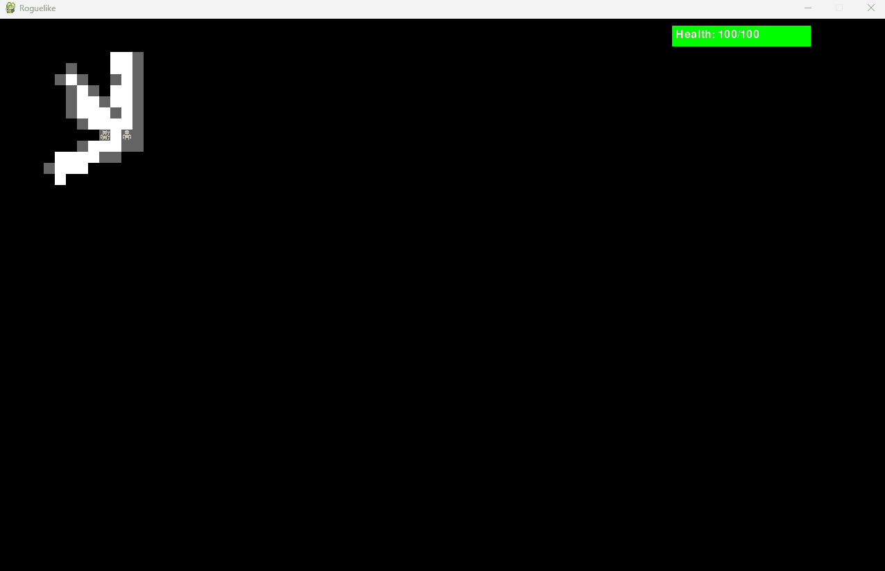

# Python Roguelike Game

Python Roguelike is a turn-based roguelike game developed using the Pygame library. It features procedurally generated dungeons, a field of view system using shadow casting, and a simple combat and inventory system.



## Installation

1. **Clone the repository:**

   ```bash
   git clone https://github.com/egemertgulderen/PythonRoguelike.git

   
2. **Navigate to the project directory:**

   ```bash
   cd PythonRoguelike
   ```

3. **Create a virtual environment (optional but recommended):**

   ```bash
   python3 -m venv venv
   ```

4. **Activate the virtual environment:**

   - **On Windows:**

   ```bash
   venv\Scripts\activate
   ```

   - **On macOS and Linux:**

   ```bash
   source venv/bin/activate
   ```

5. **Install dependencies:**

   ```bash
   pip install -r requirements.txt
   ```

## Usage

To run the Python Roguelike game, execute the following command:

```bash
python main.py
```
